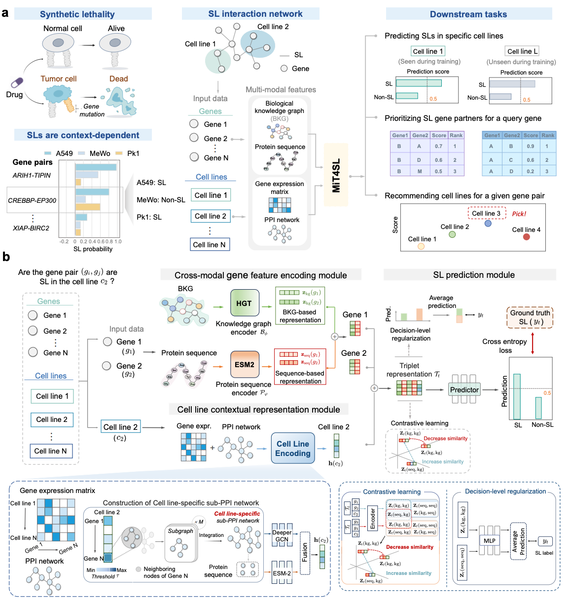

<div align="center">

# MiT4SL: Context-aware deep learning enables adaptive synthetic lethality prediction across cancer cell lines

We introduce MiT4SL, a context-aware representation learning framework that achieves accurate synthetic lethality (SL) prediction on seen cell lines while generalizing effectively to unseen ones. MiT4SL represents biological contexts as learnable embeddings and jointly encodes them with gene pair representations. The resulting contextualized triplet embeddings capture both shared and cell-line-specific mechanisms, enabling context-adaptive SL prediction.

[](https://www.python.org/)
[](https://opensource.org/licenses/MIT)
[]()

[Paper](https://doi.org/10.1101/2025.04.20.649694) | [Data](https://drive.google.com/drive/folders/1EPKHnXkcFEGLc_YbRMdzzTNojFVq1NJh?dmr=1&ec=wgc-drive-%5Bmodule%5D-goto) | [GitHub](https://github.com/JieZheng-ShanghaiTech/MiT4SL)

</div>

## Overview 



**Overview of MiT4SL.** MiT4SL is designed to predict SL interactions across diverse contexts, ranging from well-characterized to unexplored cell lines. To address data sparsity and context-specificity, MiT4SL incorporates cell-line-specific information with effective gene-pair representations. This flexible framework achieves superior performance in both established and unseen cell lines. Beyond its predictive accuracy, the versatility of the triplet representation allows MiT4SL to serve diverse roles. For example, it can identify novel SL partners for a target gene or prioritize optimal cellular contexts for specific gene-pair interactions. 


---


## Table of Contents

- [Installation](#1-installation)
- [Download Data](#2-download-data)
- [Run MiT4SL](#3-run-mit4sl)
- [Configuration System](#4-configuration-system)
- [Project Structure](#5-project-structure)
- [Cite](#6-how-to-cite)

---

## 1. Installation


### Create a new environment

First, create a new virtual environment for MiT4SL. We recommend using Python `>=3.10`, and the local verified environment uses Python **3.10.6**.

```bash
# Create a new environment with Python 3.10
conda create -n mit4sl python=3.10 
# Activate the environment
conda activate mit4sl
```

### Install dependencies

We provide two options for installing dependencies.

**Option 1: install from `pyproject.toml`**

Please upgrade packaging tools first:

```bash
python -m pip install --upgrade pip setuptools

```
Then install the package in editable mode:

```bash
pip install -e .
```

**Option 2: install from `requirements.txt`**

```bash
pip install -r requirements.txt
```


:pushpin: **Note: Install PyTorch Geometric-related wheels manually**
If the default installation does not resolve the PyTorch Geometric stack correctly on your machine, install the PyTorch Geometric-related extensions against your local PyTorch/CUDA build. For example, for **PyTorch 1.12.1 + CUDA 11.3**:
```bash
pip install torch-scatter==2.1.0 torch-sparse==0.6.16 -f https://data.pyg.org/whl/torch-1.12.1+cu113.html
pip install torch-geometric==1.6.0
```
> Browse [data.pyg.org/whl](https://data.pyg.org/whl/) for other CUDA/PyTorch combinations. Adjust the `--find-links` URL to match your installed PyTorch/CUDA version.


## 2. Download data

Due to data size and availability restrictions, the target dataset must be manually downloaded. You can access it from the dataset URL: [Dataset](https://drive.google.com/drive/folders/1EPKHnXkcFEGLc_YbRMdzzTNojFVq1NJh?dmr=1&ec=wgc-drive-%5Bmodule%5D-goto). Make sure to download the dataset and place it in the appropriate directory `data` before running the program.

**Step 1:** Download the [Dataset](https://drive.google.com/drive/folders/1EPKHnXkcFEGLc_YbRMdzzTNojFVq1NJh?dmr=1&ec=wgc-drive-%5Bmodule%5D-goto).

**Step 2:** Place everything under `data/` at the project root. The expected layout is:

```text
data/
├── MultiOmics_feature/
├── SLbench/
├── SL_partner_recommendation/
├── Cell_line_recommendation/
└── Case_study_TE1/
```

 The main dataset resources are organized as follows:

  | Folder | Contents |
  |---|---|
  | `MultiOmics_feature/` | PrimeKG-derived graph assets, protein sequence embeddings, and cell-line-specific PPI features |
  | `SLbench/` | Benchmark splits for specific-cell-line and cross-cell-line SL prediction |
  | `SL_partner_recommendation/` | Partner recommendation tasks such as `A549_KRAS` and `A549_TP53` |
  | `Cell_line_recommendation/` | Recommendation benchmarks for the `Dede` and `Ito` collections |
  | `Case_study_TE1/` | TE-1 case-study data |


:bulb: Additional notes for selected datasets are available in:

- `data/MultiOmics_feature/README.md`
- `data/Cell_line_recommendation/README.md`
- `data/Case_study_TE1/README.md`

## 3. Run MiT4SL

### Quick start

Launch the default experiment (cross-cell-line, target `A549`):

```bash
bash scripts/run_mit4sl.sh
```

If you need to override the configured runtime device, add `--device <id>` (for example, `--device 0`).

Optionally, inspect the default configuration files selected by the launcher and preview the full training command without
starting the run:
```bash
bash scripts/run_mit4sl.sh --dry-run
```

By default, the launcher runs the cross-cell-line example with target cell line `A549`:

```bash
python src/train_MiT4SL.py \
  --cfg configs/cross_cell_line/protocol.yaml \
  --cfg configs/cross_cell_line/Multi_5_to_A549.yaml
```


### List available targets for a config set

```bash
bash scripts/run_mit4sl.sh --config-dir cross_cell_line --list-targets
```

### Run other scenarios

- Cell-line-specific random splitting:

```bash
bash scripts/run_mit4sl.sh --config-dir cell_line_specific/random --target A549
```

- Cross-cell-line transfer to another target cell line:

```bash
bash scripts/run_mit4sl.sh --config-dir cross_cell_line --target 22Rv1
```

- SL partner recommendation:

```bash
bash scripts/run_mit4sl.sh --config-dir recom_sl_partner --target A549_KRAS
```

- Cell line recommendation:

```bash
bash scripts/run_mit4sl.sh --config-dir recom_sl_cell_line/dede --target A549
```

### Run the training script directly

If you prefer to skip the shell wrapper, you can run the training script directly by providing both the protocol config and the target config:

```bash
python src/train_MiT4SL.py \
  --cfg <protocol.yaml> \
  --cfg <target.yaml>
```
You can also override the output directory or runtime device:
```bash
python src/train_MiT4SL.py \
  --cfg configs/cross_cell_line/protocol.yaml \
  --cfg configs/cross_cell_line/Multi_5_to_A549.yaml \
  --device 0 \
  --Save_model_path result/custom_run
```


### Outputs

By default, run outputs are written under the configured `RESULT.SAVE_PATH` (typically `result/`).

```text
result/
└── <setting>/
    └── <cell_or_target>/
        └── <run_tag>/
            ├── checkpoint
            ├── train.log
            ├── <cell_or_target>_results.txt
            ├── final_result_eval.csv
            ├── resolved_config.yaml
            └── run_metadata.json
```

The main output files are:

- `checkpoint`: saved model checkpoint, including the model state and optimizer state.
- `train.log`: full training log, including setup information and periodic training, validation, and test metrics.
- `<cell_or_target>_results.txt`: human-readable summary of per-run results, together with the final mean and standard deviation.
- `final_result_eval.csv`: compact table of the evaluation metrics for each run, plus aggregated `average` and `std` rows.
- `resolved_config.yaml`: the fully merged runtime config after combining `protocol.yaml` with the target-specific YAML.
- `run_metadata.json`: structured metadata describing the resolved run, such as config files, repeat mode, selected learning rate, and effective epoch budget.


## 4. Configuration system


MiT4SL uses a two-stage configuration pattern:

1. `protocol.yaml` stores the shared settings for one experiment family.
2. A target-specific YAML stores the cell-line- or task-specific override.

The launcher resolves and merges this pair automatically. For example:

```bash
bash scripts/run_mit4sl.sh --config-dir cross_cell_line --target A549
```

For the full configuration catalog and directory layout, see [`configs/README.md`](./configs/README.md).


## 5. Project Structure

```text
MiT4SL/
├── configs/                 # Experiment YAMLs (protocol + target overrides)
├── data/                    # Released datasets and supporting assets
├── result/                  # Output directory for runs
├── scripts/                 # Shell launcher and script-level docs
├── src/                     # Core model, training, utilities, config loading
├── tests/                   # Regression and integrity tests
├── tutorials/               # Notebooks for rebuilding contextualized PPI assets and SL benchmark splits
├── fig_overview_mit4sl.png  # Overview figure used in the README
├── pyproject.toml           # Project metadata and Python requirement
└── requirements.txt         # Pinned dependency list
```


For readers who want to understand or rebuild the processed assets, see [`tutorials/README.md`](./tutorials/README.md) and the notebooks under `tutorials/`,
including:

- tutorials/contextualized_PPI_construction.ipynb
- tutorials/cell_line_specific_scenario_construction.ipynb
- tutorials/cross_cell_line_scenario_constrcution.ipynb


## 6. How to cite

If you find MiT4SL useful in your research, please consider citing:

```bibtex
@article{tao2025mit4sl,
  title={MiT4SL: multi-omics triplet representation learning for cancer cell line-adapted prediction of synthetic lethality},
  author={Tao, Siyu and Feng, Yimiao and Yang, Yang and Wu, Min and Zheng, Jie},
  journal={bioRxiv},
  year={2025},
  publisher={Cold Spring Harbor Laboratory}
}
```
If you have questions or encounter reproducibility issues, please feel free to contact us:
**Siyu Tao**: [taosy2022@shanghaitech.edu.cn](mailto:taosy2022@shanghaitech.edu.cn)
**Jie Zheng** (corresponding author): [zhengjie@shanghaitech.edu.cn](mailto:zhengjie@shanghaitech.edu.cn)
